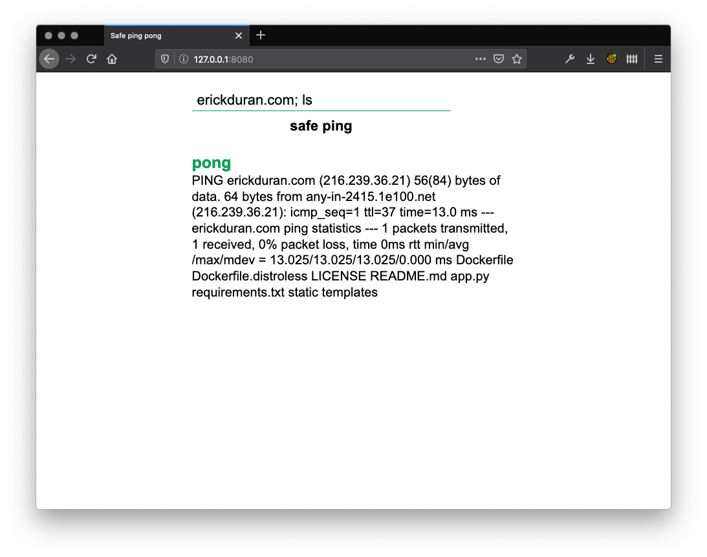
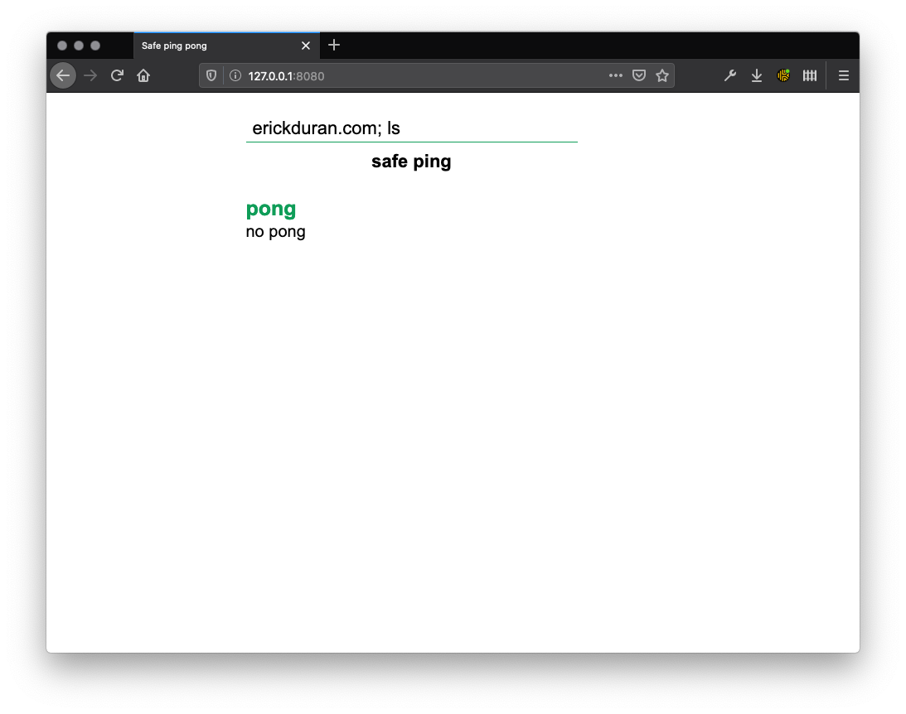
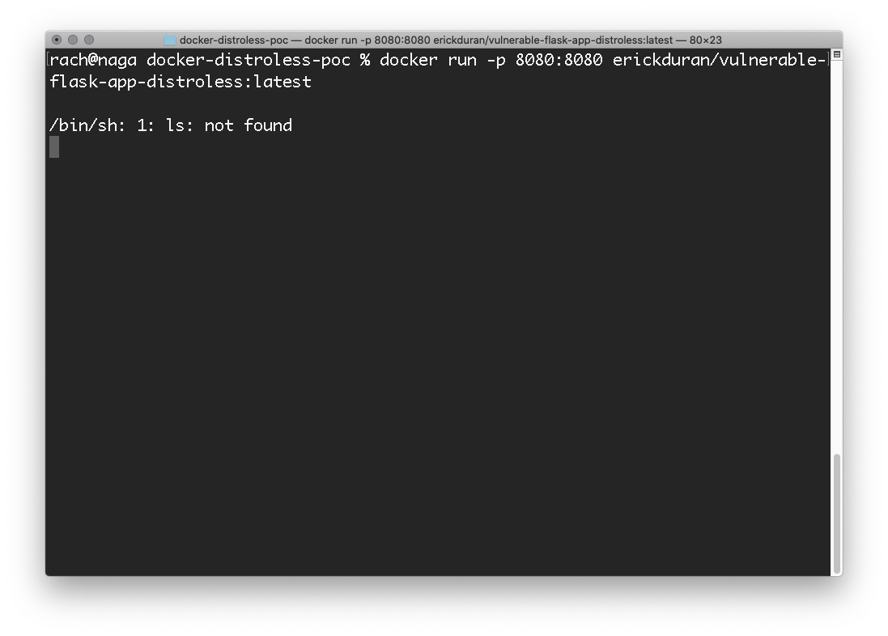

# docker-distroless-poc
This repository is a simple Proof of Concept about the advantages of using ["distroless" Docker images](https://github.com/GoogleContainerTools/distroless).

## Motivation
I encountered a few open source projects starting to implement distroless images, so I was curious about at what extent you can truly win by following this idea. Distroless images come with the promise of being more secure by design, so this proof of concept tries to point out a few pros and cons to demonstrate if it's worth the extra effort.

## Objectives
- Build a simple vulnerable web app with both distroless and distro(ish?) approaches
- Deploy the vulnerable app and attempt RCE
- Deploy distroless app and attempt RCE

## Application description
The purpose of the application is to prompt the user for an address to ping to, and display the results of the ping. It was poorly coded using Python3 and the Flask framework.

The application is vulnerable to RCE as there is no input sanitization and the user's input is passed directly to the OS's `ping` command.
## Installation
### Prerequisites
- Docker

### Usage
To run the distroish version:
```bash
docker run -p 8080:8080 erickduran/vulnerable-flask-app:latest
```
And browse to http://127.0.0.1:8080.

To run the distroless version:
```bash
docker run -p 8080:8080 erickduran/vulnerable-flask-app-distroless:latest
```
And browse to http://127.0.0.1:8080.

You can test the RCE by typing `erickduran.com; ls` into the text box.

### Proof of Concept
Attempting a simple RCE with a OS command using the regular Docker image, we receive the output:


However, in the distroless image, we do not get the same result:


But... the command was actually attempted:


The RCE happened, but it is way harder for an attacker to perform any malicious task or retrieve any information as the common commands and tools are not available.

## Conclusions
- You are alone with your code: **distroless** means that, **distroless**. Having a completely empty image means that you will need to explicitly pass all the libraries and binaries that your project requires. This may be fairly straightforward for this project, but it might be a headache for big and complex projects.
- If your code is vulnerable, you are **less** susceptible a RCE that leads to a shell, but the RCE is still happening. Even though you don't have any of the default Linux binaries, your programming language is still there and it needs to work. For this case, it is a bit hard to achieve something using Python as there was virtually no way to install something (no `requests`, no `pip`, no `curl` (OS), etc.), but you can potentially draft a pure-Python script to do any dirty stuff, or make use of the modules installed within the project. 
- You have more control of your environment. As it is already one of the great advantages of Docker, distroless images give you a bit more control so you are more aware of what you need and what your code is doing. However, this comes with the disadvantage of having to spend more time setting up a working build.

## Future tasks
- Further pentesting (attempt a decent shell using the implementation programming language, retrieve files using project libraries, etc.)
- Explore advantages Bazel builds
- Implement vulnerable projects with other distroless images

## Authors
Erick Durán. Copyright © 2020.

## License
Released under the MIT LICENSE.
